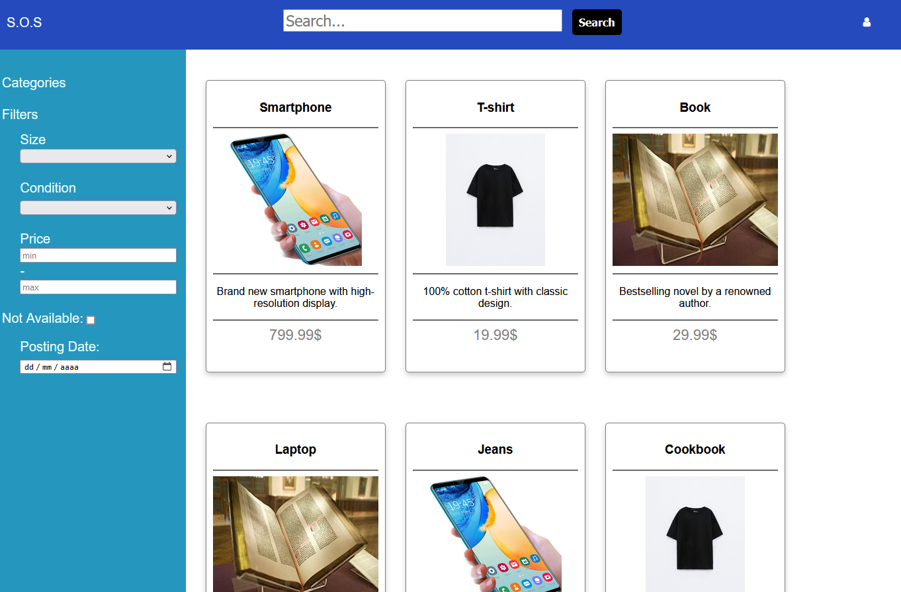
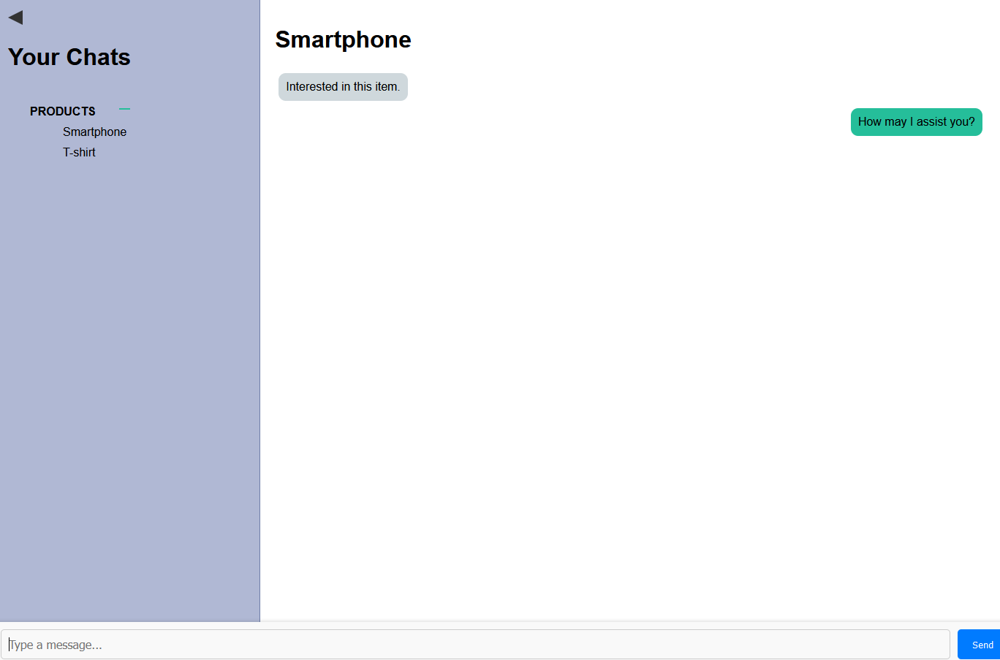

# FEUP - LTW
## Web Technologies and Languages

This project is for the UC of LTW.

# S.O.S - Sell Old Stuff

## Group ltw08g05

- João Fernandes (up202108044) 33%
- Tomás Moreira (up202108858) 33%
- Eduardo Roçadas (up202108758) 33%

## Install Instructions

To note that you should have both sqlite3 and php packages to work!

    git clone https://github.com/FEUP-LTW-2024/ltw-project-2024-ltw08g05
    git checkout final-delivery-v1
    sqlite database/LTW.db < database/LTW.sql
    php -S localhost:9000

## Screenshots

## Implemented Features

**General**:

- [X] Register a new account.
- [X] Log in and out.
- [X] Edit their profile, including their name, username, password, and email.

**Sellers**  should be able to:

- [X] List new items, providing details such as category, brand, model, size, and condition, along with images.
- [X] Track and manage their listed items.
- [X] Respond to inquiries from buyers regarding their items and add further information if needed.
- [X] Print shipping forms for items that have been sold.

**Buyers**  should be able to:

- [X] Browse items using filters like category, price, and condition.
- [X] Engage with sellers to ask questions or negotiate prices.
- [X] Add items to a wishlist or shopping cart.
- [X] Proceed to checkout with their shopping cart (simulate payment process).

**Admins**  should be able to:

- [X] Elevate a user to admin status.
- [X] Introduce new item categories, sizes, conditions, and other pertinent entities.
- [X] Oversee and ensure the smooth operation of the entire system.

**Security**:
We have been careful with the following security aspects:

- [X] **SQL injection**
- [X] **Cross-Site Scripting (XSS)**
- [X] **Cross-Site Request Forgery (CSRF)**

**Password Storage Mechanism**:  sha256 / hash_password&verify_password

**Aditional Requirements**:

We also implemented the following additional requirements (you can add more):

- [ ] **Rating and Review System**
- [ ] **Promotional Features**
- [ ] **Analytics Dashboard**
- [ ] **Multi-Currency Support**
- [ ] **Item Swapping**
- [ ] **API Integration**
- [ ] **Dynamic Promotions**
- [ ] **User Preferences**
- [ ] **Shipping Costs**
- [ ] **Real-Time Messaging System**
